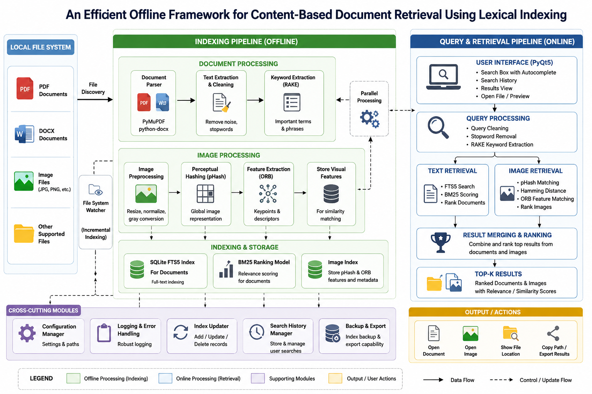
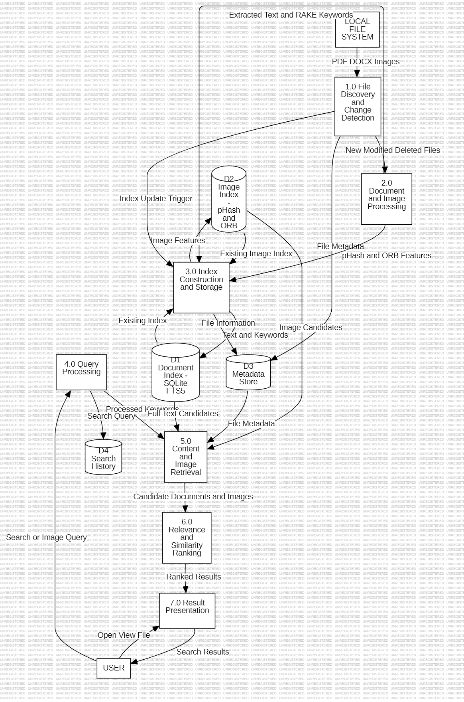
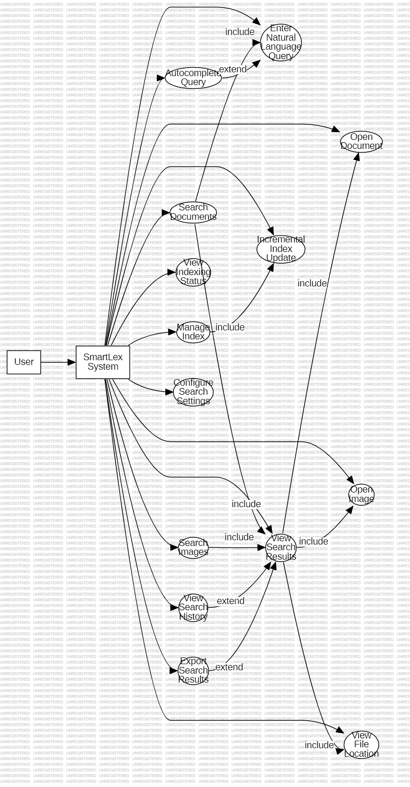
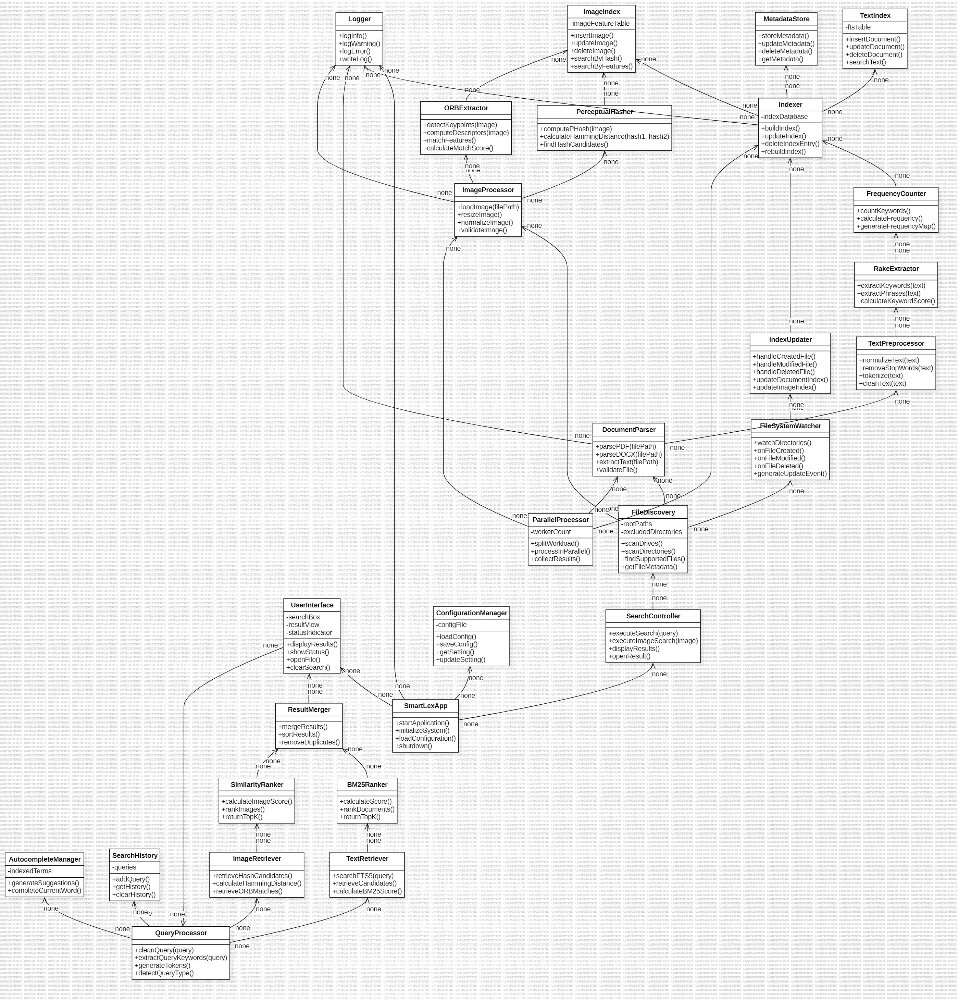
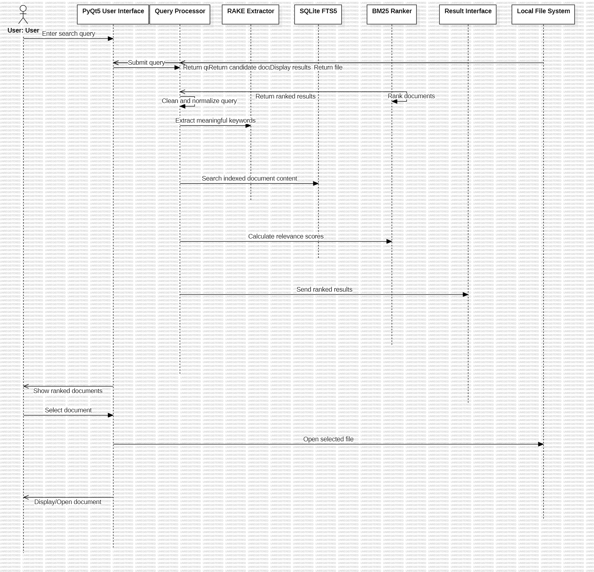
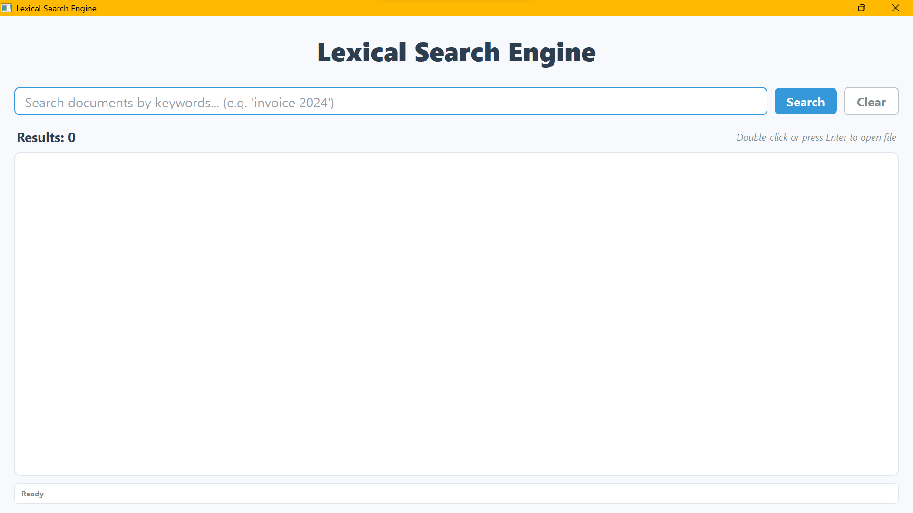

# SmartLex — Offline Content-Based Document Retrieval Using Lexical Indexing

SmartLex is a lightweight, privacy-preserving **offline desktop search engine** designed for efficient content-based retrieval from local **PDF, DOCX, and image files**. Instead of relying only on filenames, SmartLex analyzes file content, builds searchable indexes, ranks results by relevance, and supports visual similarity search for images.

The system combines **lexical indexing, RAKE keyword extraction, SQLite FTS5, BM25-style relevance ranking, parallel processing, incremental indexing, perceptual hashing, and ORB feature matching** within a unified desktop interface.

---

## 📌 Project Overview

Finding a specific document or image in a large local collection can be difficult when users remember the **content** but not the filename or location.

Traditional file search systems are often limited to:

* Filename matching
* Basic metadata
* Manual folder navigation
* Limited content-based ranking
* No visual similarity search for images

SmartLex addresses these limitations by providing a **local content-based retrieval framework** that processes files directly on the user's device.

### Key Goals

* Search documents using their **actual textual content**
* Extract important keywords automatically
* Retrieve results using lexical indexing
* Rank results according to relevance
* Search images based on visual similarity
* Support incremental indexing when files change
* Provide autocomplete and ranked results
* Maintain user privacy through completely local processing
* Avoid dependence on cloud APIs, vector databases, or heavy embedding models

---

# ✨ Key Features

### 📄 Text Retrieval

* PDF and DOCX content extraction
* RAKE-based keyword extraction
* Lexical/inverted indexing
* SQLite FTS5 persistent text indexing
* BM25-based relevance ranking
* Partial keyword matching
* Multi-word query support
* Ranked search results

### 🖼️ Image Retrieval

* Image indexing
* Perceptual hashing (pHash)
* Hamming-distance comparison
* ORB local feature matching
* Combined visual similarity ranking
* Near-duplicate image detection

### ⚡ Performance

* Multiprocessing for initial indexing
* Persistent indexes
* Incremental indexing
* Avoids unnecessary reprocessing
* Resource-aware processing

### 🖥️ User Interface

* Desktop GUI
* Search box
* Autocomplete suggestions
* Ranked results
* Search history
* Direct file access
* Clear/search controls

### 🔄 Dynamic Indexing

* Detects file creation
* Detects file modification
* Detects file deletion
* Updates the index incrementally
* Reduces the need for complete re-indexing

### 🔐 Privacy

All major processing takes place locally.

SmartLex does **not require**:

* Cloud search services
* Remote document uploads
* External search APIs
* Vector databases
* GPU-based embedding models

---

# 🏗️ System Architecture

The following architecture represents the overall SmartLex framework.



**Fig. 1. System Architecture of the Proposed SmartLex Framework**

The system is organized into the following major stages:

1. Local File System
2. File Discovery and Monitoring
3. Document Processing
4. Image Processing
5. Keyword/Feature Extraction
6. Indexing and Storage
7. Query Processing
8. Retrieval and Ranking
9. Result Management
10. GUI Presentation

The architecture also supports **incremental indexing** and supporting services such as resource monitoring and configuration management.

---

# 📊 Data Flow Diagram



**Fig. 2. Data Flow Diagram of the SmartLex System**

The data flow begins with files available in the local filesystem. Files are discovered and routed to the appropriate processing pipeline.

### Text Pipeline

```text
PDF / DOCX
    ↓
Document Parsing
    ↓
Text Extraction
    ↓
RAKE Keyword Extraction
    ↓
Lexical Indexing
    ↓
SQLite FTS5
    ↓
Query Processing
    ↓
BM25 Ranking
    ↓
Search Results
```

### Image Pipeline

```text
Image
   ↓
Image Feature Extraction
   ↓
pHash + ORB
   ↓
Image Index
   ↓
Query Image
   ↓
Similarity Calculation
   ↓
Ranked Visual Results
```

---

# 👤 Use Case Diagram



**Fig. 3. Use Case Diagram of the SmartLex System**

The primary user interactions include:

* Search documents
* Search images
* Enter search queries
* Use autocomplete
* View ranked results
* Open retrieved files
* Clear search results
* Monitor indexed content

The system internally performs:

* File discovery
* Content extraction
* Keyword extraction
* Index construction
* Query processing
* Relevance ranking
* Image similarity computation
* Incremental index updates

---

# 🧩 Class Diagram



**Fig. 4. Class Diagram of the SmartLex System**

The class structure separates the system into logical components for:

* Core processing
* Text processing
* Image processing
* Search and retrieval
* GUI functionality
* Configuration and supporting services

This modular structure allows individual components to be maintained and extended independently.

---

# 🔁 Sequence Diagram



**Fig. 5. Sequence Diagram for SmartLex Search**

A typical search operation follows this sequence:

1. User enters a query.
2. GUI receives the query.
3. Query processing module processes the input.
4. Search engine accesses the persistent index.
5. Matching documents are retrieved.
6. Results are ranked according to relevance.
7. Ranked results are returned to the GUI.
8. User can open the required file directly.

---

# 🔍 How SmartLex Works

## 1. File Discovery

SmartLex identifies supported files from the configured local directories.

Supported formats include:

| Category  | Formats |
| --------- | ------- |
| Documents | `.pdf`  |
| Documents | `.docx` |
| Images    | `.png`  |
| Images    | `.jpg`  |

The file discovery process identifies files that need to be initially indexed or updated.

---

## 2. Document Processing

For supported documents, SmartLex extracts textual content from the files.

The extracted text becomes the input for subsequent keyword extraction and lexical indexing.

---

## 3. Keyword Extraction

SmartLex uses **RAKE (Rapid Automatic Keyword Extraction)** to identify important terms and phrases from documents.

The extracted keywords support:

* Content representation
* Search matching
* Autocomplete
* Efficient lexical retrieval

---

## 4. Text Indexing

The processed document content is stored in a persistent searchable index.

SmartLex uses **SQLite FTS5** for full-text retrieval.

The lexical indexing approach enables efficient matching without requiring semantic embeddings.

---

## 5. Query Processing

When a user enters a query:

```text
User Query
    ↓
Query Processing
    ↓
Lexical Search
    ↓
Matching Documents
    ↓
Relevance Ranking
    ↓
Ranked Results
```

The search engine can return documents containing relevant query terms, including partial keyword matches where supported.

---

## 6. Relevance Ranking

Retrieved documents are ranked according to their relevance to the user's query.

SmartLex uses **BM25-style relevance ranking through the full-text search layer** to prioritize more relevant matches.

This allows users to see the most useful results near the top rather than receiving an unordered list of matching files.

---

# 🖼️ Image Search

SmartLex extends content-based retrieval beyond text documents by supporting visual similarity search.

Two complementary techniques are used.

### Perceptual Hashing

pHash generates a compact representation of an image's visual characteristics.

Similarity is measured using **Hamming distance**.

A smaller Hamming distance indicates greater visual similarity.

### ORB Feature Matching

ORB identifies local visual features and descriptors.

It is useful for identifying similar images even when there are changes in:

* Scale
* Rotation
* Cropping
* Local image content

### Combined Ranking

The image search pipeline combines visual similarity information from pHash and ORB to rank candidate images.

```text
Query Image
     ↓
pHash Extraction
     ↓
ORB Feature Extraction
     ↓
Candidate Comparison
     ↓
Similarity Calculation
     ↓
Combined Ranking
     ↓
Visual Search Results
```

---

# 🔄 Incremental Indexing

A major objective of SmartLex is to avoid rebuilding the entire index whenever the local file collection changes.

The monitoring component detects filesystem changes such as:

* New files
* Modified files
* Deleted files

The corresponding index entries can then be updated.

```text
File Created / Modified / Deleted
              ↓
       Change Detection
              ↓
       Incremental Update
              ↓
       Persistent Index
```

This reduces unnecessary computation during subsequent executions.

---

# ⚡ Parallel Processing

Initial indexing can involve a large number of files.

SmartLex uses parallel processing to improve the efficiency of this stage.

The general workflow is:

```text
File Collection
      ↓
Task Distribution
      ↓
Parallel Processing
      ↓
Content Extraction
      ↓
Keyword / Feature Extraction
      ↓
Index Construction
```

Parallel processing is primarily beneficial during the initial indexing workload, while persistent indexing reduces the amount of work required during subsequent searches.

---

# 🛠️ Technology Stack

| Component              | Technology               |
| ---------------------- | ------------------------ |
| Programming Language   | Python                   |
| GUI                    | PyQt5                    |
| PDF Processing         | PyMuPDF                  |
| DOCX Processing        | python-docx              |
| Keyword Extraction     | RAKE                     |
| Text Search            | SQLite FTS5              |
| Relevance Ranking      | BM25                     |
| Image Processing       | Pillow / OpenCV          |
| Image Similarity       | pHash + Hamming Distance |
| Local Feature Matching | ORB                      |
| OCR Support            | Tesseract                |
| Testing                | Pytest / pytest-qt       |
| Version Control        | Git / GitHub             |

---

# 📁 Project Structure

```text
Local-Search-Engine/
│
├── all/
│
├── docs/
│   └── image_search.md
│
├── images/
│   ├── architecture.png
│   ├── class_diagram.png
│   ├── dfd.png
│   ├── Initial_Window.png
│   ├── Output_Window.png
│   ├── sequence_diagram.png
│   └── use_case_diagram.png
│
├── src/
│   └── smartlex/
│       ├── core/
│       ├── gui/
│       ├── image/
│       ├── text/
│       └── main.py
│
├── tests/
│
├── config.json
├── implementation_plan.md
├── init_system.py
├── pyproject.toml
├── requirements.txt
├── run.py
├── test_patent_logic.py
├── LICENSE
└── readme.md
```

---

# 💻 Installation

## Prerequisites

Make sure the following are installed:

* Python 3.x
* Git
* Tesseract OCR for OCR-related functionality

### Clone the Repository

```bash
git clone <repository-url>
cd Local-Search-Engine
```

---

## Create a Virtual Environment

### Windows

```powershell
python -m venv .venv
.venv\Scripts\Activate.ps1
```

### Linux / macOS

```bash
python3 -m venv .venv
source .venv/bin/activate
```

---

## Install Dependencies

```bash
python -m pip install --upgrade pip
pip install -r requirements.txt
```

---

# 🔤 OCR Configuration

OCR functionality uses **Tesseract OCR** where required.

On Windows, Tesseract should be installed and available through the system `PATH`.

A typical installation location is:

```text
C:\Program Files\Tesseract-OCR
```

Verify the installation:

```powershell
tesseract --version
```

If the command returns the installed Tesseract version, OCR is correctly available from the terminal.

> OCR is a supporting capability for extracting text from image-based content; the primary document retrieval approach remains lexical indexing.

---

# ⚙️ Configuration

SmartLex provides configuration through `config.json`.

Example:

```json
{
    "num_processes": 8,
    "top_keywords": 150,
    "autocomplete_words": 100,
    "supported_formats": [
        ".pdf",
        ".docx",
        ".png",
        ".jpg"
    ],
    "index_folder": "all",
    "output_file": "output.json"
}
```

### Important Configuration Note

The `index_folder` parameter determines which location is considered for indexing.

For normal use, it is recommended to configure a **dedicated folder containing the documents you want to search**, rather than unnecessarily pointing the application at a broad directory.

For example:

```json
"index_folder": "D:/MyDocuments"
```

This helps:

* Reduce unnecessary scanning
* Reduce indexing time
* Reduce generated index size
* Avoid indexing unrelated system/application files

---

# ▶️ Running SmartLex

Activate the virtual environment and execute:

```powershell
python run.py
```

The SmartLex desktop application should launch.

The interface provides:

* Search input
* Search button
* Clear button
* Autocomplete support
* Ranked search results
* File access

---

# 🔎 Performing Text Search

1. Launch SmartLex.
2. Ensure the desired document directory is configured.
3. Allow the initial indexing process to complete.
4. Enter a keyword or phrase in the search box.
5. Select an autocomplete suggestion if required.
6. Click **Search**.
7. Review the ranked results.
8. Open the required file directly from the result.

Example:

```text
Query:
machine learning

        ↓

Lexical Index

        ↓

Matching Documents

        ↓

BM25 Relevance Ranking

        ↓

Ranked Results
```

---

# 🖼️ Performing Image Similarity Search

SmartLex supports visual similarity retrieval using pHash and ORB.

A typical test workflow is:

```python
from smartlex.image.indexer import index_image
from smartlex.image.feature_store import ImageFeatureStore
from smartlex.image.search import ImageSearchService
```

The image search pipeline:

1. Index the available images.
2. Select a query image.
3. Extract its visual features.
4. Compare it with indexed images.
5. Calculate pHash/Hamming similarity.
6. Perform ORB feature matching.
7. Combine similarity information.
8. Return ranked results.

Expected behavior:

* Exact/identical query image → highest similarity
* Near-duplicate image → high similarity
* Visually related image → intermediate similarity
* Unrelated image → low similarity

For pHash:

```text
Smaller Hamming Distance
        =
Greater Visual Similarity
```

Detailed image-search documentation is available in:

```text
docs/image_search.md
```

---

# 🧪 Testing

SmartLex includes automated and manual testing.

## Run the Main Application

```powershell
python run.py
```

## Run the Patent Logic Test

```powershell
python test_patent_logic.py
```

## Run the Complete Test Suite

```powershell
python -m pytest tests/ -q
```

The implemented test suite covers the major functionality of the system, including core processing and retrieval-related components.

---

# 📈 Performance Evaluation

The underlying approach evaluates indexing and retrieval with respect to:

* Initial indexing time
* Subsequent indexing time
* Search latency
* Resource utilization
* Retrieval effectiveness

The project adopts persistent indexing so that subsequent operations can avoid repeating expensive processing unnecessarily.

The base implementation evaluation compares:

| Approach        | Initial Processing Time |
| --------------- | ----------------------: |
| Single Process  |              397,416 ms |
| Multithreading  |              612,324 ms |
| Multiprocessing |              303,418 ms |

Subsequent runs after persistent indexing were reported to require approximately **20–25 ms** for the corresponding repeated processing scenario.

These measurements demonstrate the benefit of combining **parallel processing for initial workloads with persistent indexing for subsequent operations**.

---

# 🖥️ User Interface

### Initial Window



The initial interface provides the main search controls and user interaction area.

### Search Results


The output interface presents retrieved files according to their relevance to the search query.

---

# 🔐 Privacy and Offline Processing

SmartLex is designed as an offline/local retrieval system.

Documents and images are processed on the user's machine rather than uploaded to a remote search service.

This provides several advantages:

* Local data processing
* Reduced data exposure
* No cloud document upload
* No dependency on external search APIs
* Suitable for sensitive local document collections
* Works without an internet-based retrieval service

The framework intentionally focuses on **lightweight lexical and visual retrieval rather than cloud-based semantic search**.

---

# ⚠️ Limitations

Although SmartLex provides content-based text and image retrieval, some limitations remain.

### Text Retrieval

* Lexical retrieval depends on the presence of matching terms.
* Synonyms and deeper semantic relationships may not always be identified.
* OCR quality depends on the quality of the source image/document.

### Image Retrieval

* Visual similarity does not necessarily represent semantic similarity.
* ORB matching can vary depending on image quality and transformations.
* pHash is primarily useful for perceptual/near-duplicate similarity.

### Indexing

* Initial indexing can be computationally expensive for very large collections.
* Broad indexing locations can result in unnecessary processing.
* Index size depends on the number and characteristics of indexed files.

---

# 🚀 Future Scope

Potential extensions include:

* Semantic search using lightweight embeddings
* Hybrid lexical + semantic retrieval
* Improved multimodal retrieval
* Advanced OCR preprocessing
* More image descriptors
* Support for additional document formats
* Distributed indexing for very large collections
* More sophisticated relevance-ranking models
* Improved duplicate detection
* Advanced filtering and faceted search
* Search analytics and visualization

These extensions can be introduced while retaining the current offline-first architecture.

---

# 📚 Project Contributions

The project follows a modular development structure covering:

* Core system development
* Text processing and lexical retrieval
* Image processing and visual retrieval
* GUI development
* Testing and validation
* Documentation and system architecture

The repository includes implementation, testing, documentation, and architectural diagrams to support reproducibility and future development.

---

# 📖 Documentation

Additional documentation is available in:

```text
docs/
```

Currently, image-search-specific documentation is available at:

```text
docs/image_search.md
```

---

# 🧾 License

This project is distributed under the license specified in:

```text
LICENSE
```

Please refer to that file for the applicable terms and conditions.

---

# 🎯 Summary

SmartLex provides a **lightweight, offline, content-based retrieval framework** for local documents and images.

Its key contributions are:

* **RAKE-based keyword extraction**
* **Lexical/inverted indexing**
* **SQLite FTS5 full-text retrieval**
* **BM25 relevance ranking**
* **Parallel initial indexing**
* **Incremental index maintenance**
* **Filesystem monitoring**
* **pHash-based image similarity**
* **ORB feature matching**
* **Autocomplete**
* **Ranked search results**
* **Unified desktop interface**
* **Local and privacy-preserving processing**

By combining efficient lexical retrieval with visual similarity search, SmartLex provides a practical approach to searching large collections of locally stored files without depending on cloud services or heavyweight semantic-search infrastructure.

---

## 👥 Contributors

This project was developed as a collaborative academic project.

**Project:**
**An Efficient Offline Framework for Content-Based Document Retrieval Using Lexical Indexing**

The repository history records contributions from the project team through Git and GitHub.

---

### Quick Start

For a quick setup:

```powershell
git clone <repository-url>
cd Local-Search-Engine

python -m venv .venv
.venv\Scripts\Activate.ps1

python -m pip install --upgrade pip
pip install -r requirements.txt

python run.py
```

For testing:

```powershell
python -m pytest tests/ -q
```

**SmartLex — Search your local content, not just your filenames.**
